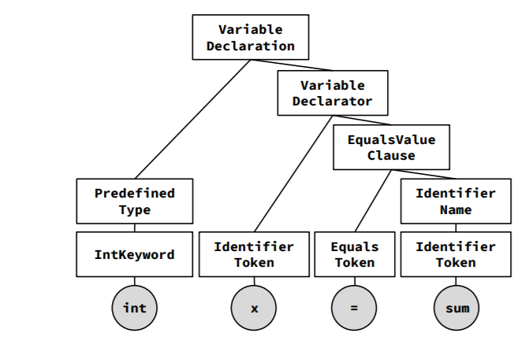
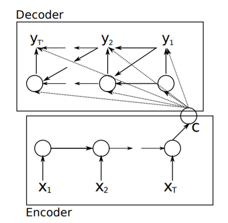
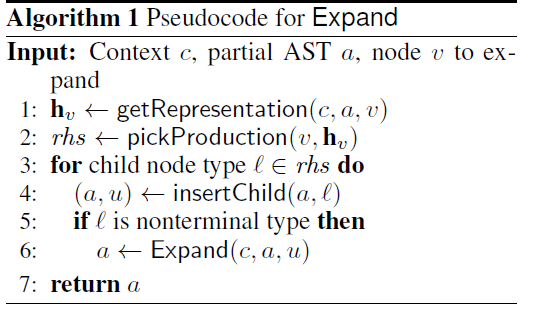
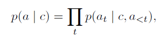

# Generative Code Modeling With Graphs

题目：Generative Code Modeling With Graphs  
作者：MarcBrockschmidt, MiltiadisAllamanis, AlexanderGaunt, OleksandrPolozov  
单位：Microsift Research  
出版：ICLR-2019  

## 问题

**TODO** 为每个任务配上例子

主要任务：根据给出的上下文信息 c 来产生符合相应描述的代码段。  

> The most general form of the code generation task is to produce a (partial) program in a programming language given some context information c.

* 上下文信息的形式
  * 自然语言
  * 输入输出的样例
  * 部分代码

提出的新任务 ExprGen：聚焦于让模型基于上下文信息产生少量但是语义复杂的表达式。

> a new code generation task focused on generating small but semantically complex expressions conditioned on source code context.

### 研究背景

1. 基于自然语言和形式语言的研究  
   自然语言类似的方法可以在源代码上取得一定的效果。在软件工程和语义分析上取得一定成就。  
   > shown successes on important software engineering tasks(Raychevetal.,2015;Bichseletal.,2016; Allamanis et al., 2018b) and semantic parsing (Yin & Neubig, 2017; Rabinovich et al., 2017).

   **TODO** 取得什么成就 & 评价指标  

    * 缺陷：只能满足部分语法要求，不能区分给定训练样本中的相似程序的不同之处。上下文的语义信息有缺失。
        > as they cannot distinguish unlikely from likely
        > sometimes fail to produce syntactically correct code

    **TODO** 反例

2. 抽象语法树相关的研究
   因为语法树保证了语法信息的正确性，所以可以通过目标语言的语法来构建抽象语法树来解决语法信息的正确问题。
   > using the target language’s grammar to generate abstract syntax trees

     

    本文使用了建立抽象语法树的基本思路，并依据编程语言的语法来有序扩展语法树，通过每次扩展语法树最底层，最左边的非终结节点来有序构造。因为每次扩展的节点的相对位置一定，所以作者将代码产生问题简化为了树扩展序列的分类问题。
    > The key idea is to construct the AST a sequentially, by expanding one node at a time using production rules from the underlying programming language grammar. This simplifies the code generation task to a sequence of classification problems ...

## 方案

### 系统架构

   本文使用了经典的 encoder-decoder 结构，将提取到的上下文信息先表示为一个向量，再逐步将其展开并生成目标代码。encoder 非本文所解决问题，本文选择 seq 和 G 两种encode 方式，decoder则使用改良的 AST generating model，作者结合属性文法，将AST 节点和代表继承属性和综合属性的节点连接形成图，最后使用GNN学习此图来进行代码生成。

   > We associate each node in the AST with two fresh nodes representing inherited resp. synthesized information (or attributes).
   > Our method for getRepresentation from Alg. 1 thus factors into two parts: a deterministic procedure that turns a partial AST a<t into a graph by adding additional edges that encode attribute relationships, and a graph neural network that learns from this graph.

**TODO** 假设和使用方案的动机

## 原理

### encoder--decoder模型

原理如图：

此结构同样保证了在生成 t 时刻的信息时考虑到前 t-1 时刻的信息，因为 decoder 同样使用了 RNN 的结构，保证了表示 t 时刻的单元接受到了前 t-1 时刻的状态信息，而在开始进行 decode 之前，encoder 已经提取出了上下文信息 c 并将其传入了 decoder。即原文中表述的公式：
$$p(a|c) = \prod_{t} p(a_t|c,a_{<t})$$

#### encoder

**TODO** 确认一下两种 method 的名称是否准确 尽量使用引用文章中的名字

* Method1 -- Seq  
    使用 NLP 领域中经典的信息抽取方式 Seq 使用两层双向的 GRU 单元来学习代码空缺处的上下文信息。使用双向的 GRU 单元同时学习空缺前和空缺后的语义信息，选取最后一个单元的状态信息作为传入的上下文信息 c。  
    作者使用了第二个上述的结构来学习变量在空缺前后的变化特征，并使用了上述结构来进行变量的表示学习，即将第二层的 GRU 最终状态信息经过平均池化后作为每个变量的向量表示。所以每一层的 GRU 单元数就是描述变量的个数。  
     // **TODO** 换张图表示嵌入

  * 为什么使用 GRU?
    * RNN：每一层的基本单元只进行 tanh 或 relu 操作，如果网络层次太深的话，此时会产生梯度消失或梯度下降问题。这种神经网络带有环，使网络有了一定的信息持久化能力，但是不能解决较为复杂的信息的持久化问题。
    * LSTM：可以在解决梯度消失和梯度爆炸的问题，还可以从语料中学习到长期依赖关系。但是参数较多，不容易训练且容易过拟合。
    * GRU：将遗忘门和输入门合并成为单一的“更新门”，在拥有 LSTM 网络功能的基础上进行了适当的简化。相对 LSTM 引入了更少的参数，所以网络不容易过拟合且易于训练。

* Method2 -- G  
    基于由 Allamanis 等人提出的程序图方法，将程序转化为图，并用一个虚拟节点代替目标表达式。通过 GNN 获得上下文和填空区域（即目标表达式）的所有变量表示。
    其中 GNN 是运行在图上的神经网络算法，其典型应用是节点分类，它将学习所有包含特征的节点然后用一个包含邻域信息的 d 维向量来 hv 来表示节点，从而利用这些标记预测其余节点的分类。本文作者使用此网络的前半部分，运行8步 GNN，以获得所需上下文和目标表达式的表示。
    > We then run a graph neural network for 8 steps to obtain representations for all nodes in the graph, allowing us to read out a representation for the “hole” (from the introduced dummy node) and for all variables in context.

#### decoder
   本文选择使用 AST 生成算法，构建一棵 AST 树，每次将最左最下的非终结节点扩张。
   >by fixing the order of the sequence to always expand the left-most, bottom-most nonterminal node. 
   
   AST 生成算法：
   
   
   
   生成 AST a 的概率：
   
   
   
## 实现

   使用语言与平台为TensorFlow，所生成代码为C#。[代码github](https://github.com/Microsoft/graph-based-code-modelling)
   > We have released the code for this on https://github.com/Microsoft/graph-based-code-modelling.

### 模型构建

## 评价

## 局限

1. 产生代码的类型受限，不支持用户自定的类型。
   > we restrict ourselves to expressions that have Boolean, arithmetic or string type, or arraysof such types, excluding expressions of other typesor expressionsthat use project-specific APIs

2. 模型对数据集的依赖较大，训练好的模型在新的数据集上表现不好。文中指出本问题出现的根源是新数据集中存在原先项目中没有出现过的新词汇，可以认为是 NLP 任务中常见的 OOV (out of vocabulary) 问题导致的结果恶化。
   > Transferring a trained model to unseen projects with a new project-specific vocabulary substantially worsens results, as expected.

## 展望

1. 由于上述局限1提出的在用户自定类型上的学习不足导致生成代码的变量类型受限，可以使用和提取变量信息类似的方法，专门将定义类型的代码进行嵌入，使用来代表新的类型。但是由于定义类型使用的代码数量较少难以训练，可以先学习基础类型（整型，浮点型等）的向量表示，将此问题转化为一个 transfer learning 的相关问题。
