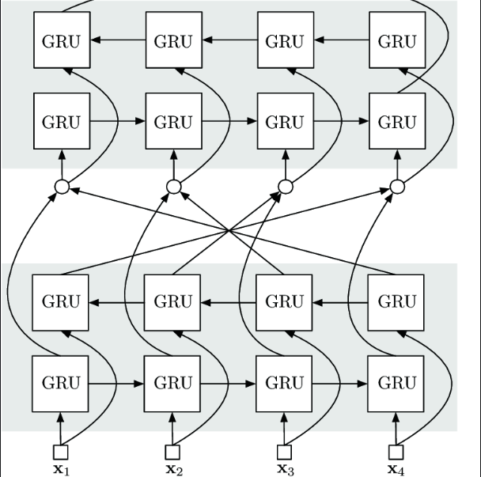

#   Generative Code Modeling With Graphs
  
  
  
题目：Generative Code Modeling With Graphs
作者：MarcBrockschmidt, MiltiadisAllamanis, AlexanderGaunt, OleksandrPolozov
单位：Microsift Research
出版：ICLR-2019
  
##   问题

主要任务：根据给出的上下文信息 c 来产生符合相应描述的代码段。

> The most general form of the code generation task is to produce a (partial) program in a programming language given some context information c.
  
* 上下文信息的形式
  * 自然语言
  * 输入输出的样例
  * 部分代码
  
提出的新任务 ExprGen：聚焦于让模型基于上下文信息产生少量但是语义复杂的表达式。
  
> a new code generation task focused on generating small but semantically complex expressions conditioned on source code context.
  
  
  上图为新任务ExprGen的一个例子，图中阴影部分就是需要让模型产生的表达式。新任务ExprGen相较于之前的任务而言，其优点在于它能生成语义更复杂更准确的表达式，但缺点就是生成的表达式的规模比较小。
* 应用场景：
  * 在有上下文的情况下快速进行代码重构和相关修复
  * 可以快速进行 code review 时的 refactor，提供代码替换选项
  
###   研究背景
  
  
  
1. 基于自然语言和形式语言的研究
   自然语言类似的方法可以在源代码上取得一定的效果。许多语言模型通过计算每一个词基于已经生成的词的条件概率来计算整个代码片段的概率分布。在软件工程和语义分析上取得一定成就。
   > shown successes on important software engineering tasks(Raychevetal.,2015;Bichseletal.,2016; Allamanis et al., 2018b) and semantic parsing (Yin & Neubig, 2017; Rabinovich et al., 2017).
  
   **TODO** 取得什么成就 & 评价指标
  
    * 缺陷：只能满足部分语法要求，不能区分给定训练样本中的相似程序的不同之处。上下文的语义信息有缺失。
        > as they cannot distinguish unlikely from likely
        > sometimes fail to produce syntactically correct code
  
  
    * 基于枚举和演绎的程序综合工具成功地生成了满足某些（通常是不完整）形式的规范程序，但是在人工手动检查中通常显然是错误的，因为它们无法将可能的程序与可能的“自然”程序区分开。
        > For example, program synthesis tools based on enumeration and deduction (Solar-Lezama, 2008; Polozov & Gulwani, 2015; Feser et al., 2015; Feng et al., 2018) are successful at generating programs that satisfy some (usually incomplete) formal specification but are often obviously wrong on manual inspection, as they cannot distinguish unlikely from likely, “natural” programs.
  
    * 另一方面，学习后的代码模型能够成功生成十分逼真的程序。 但是，这些程序经常在语义上并不相关，例如，因为变量使用并不统一。
        > On the otherhand,learned code models have succeeded in generating realistic-looking programs(Maddison & Tarlow, 2014; Bielik et al., 2016; Parisotto et al., 2017; Rabinovich et al., 2017; Yin & Neubig, 2017). However,these programs often fail to be semantically relevant,for example because variables are not used consistently.
  
2. 抽象语法树相关的研究
   因为语法树保证了语法信息的正确性，所以可以通过目标语言的语法来构建抽象语法树来解决语法信息的正确问题。相比之前的工作，这种方法使用了目标语言的语法树，从根本上解决了语法错误的问题。
   > using the target language’s grammar to generate abstract syntax trees
  
   
  
    本文使用了建立抽象语法树的基本思路，并依据编程语言的语法来有序扩展语法树，通过每次扩展语法树最底层，最左边的非终结节点来有序构造。因为每次扩展的节点的相对位置一定（一般是最底层的最左边的非终结节点），序列构成最左或最右推导，所以作者将代码产生问题简化为了树扩展序列的分类问题。
    > The key idea is to construct the AST a sequentially, by expanding one node at a time using production rules from the underlying programming language grammar. This simplifies the code generation task to a sequence of classification problems ...

    利用树形网络生成代码时，通常按照从上到下从左至右的顺序生成树的子节点。一般来说，生成树结构的深度学习模型很难学习：首先这种模型计算成本很高，其次对树生成过程的上下文建模需要更加复杂的数据结构(与序列模型相比)。一些研究者利用机器学习的方法对抽象语法树建模，分别利用上下文无关文法和决策树对抽象语法树建模并预测代码。深度学习方法比机器学习网络结构更为复杂，需要根据抽象语法树的结构定制新的网络.
  
    

3. 编程语言与自然语言的区别
    * 强结构性：虽然自然语言的句子可以被解析为依存语法树或成分树，但由于使用的语法规则是由语言学家在语料中归纳得到，往往不能包含全部情况，且自然语言先天具有歧义性，其结构性较弱，而程序语言具有强结构性。通常一段代码可以按定义的语法规则解析为唯一对应的抽象语法树。
    * 无限制的字典：字典是训练语言模型所必需的，程序语言和自然语言都有无限的字典。对于自然语言来说，一种语言常用的词是有限的，人们很少会遇到罕见的词汇。而程序语言则不同，程序员会定义不同的变量和方法名，这使得同样规模的语料库中，程序语言包含的字典大小往往会大于自然语言。
    * 演化速度快：自然语言发展至今，虽然也存在种种演化，但其速度较慢。而程序语言的语料库大多选自一些开源的代码库，对于一个软件系统来说，版本演化是很常见的现象，演化过程通常伴随着对系统缺陷的修复和添加新的功能特征。
    * 局部性特征：与自然语言相比，程序语言在一定范围内会重复出现。例如我们在定义一个变量后，该变量往往会在后文代码出现；当我们引入一个库后，通常在后文中会调用该库中的 API。
  
## 前置知识

### 嵌入 embedding

embedding(Index)函数为参考嵌入层（Embedding layer）而构造学习的一个单射的映射函数。其目的在于把正整数（Index）转换为固定大小的稠密向量，需要指出的是嵌入向量的长度是一个超参数，不可训练。如果向量维数过低，可能造成不同向量间的距离过近，引入有歧义的语义信息。如果向量维数过高，可能加大计算量，降维的效果不明显。

* 使用 embedding 的原因
  * 独热编码（One-hot encoding）向量是高维且稀疏的。对于序列数量较多情况下，使用独热编码时，所映射成的向量中有num-1个元素都为0（num为序列数），在大数据集下使用这种方法的计算效率是很低的。
  * 每个嵌入向量会在训练神经网络时更新。对于任何能够通过使用嵌入层而把它变成向量的东西，为了方便计算，进行向量映射是明智的选择。

* Embedding作用在词语上的一个例子：
    > “deep learning is very deep”
  
  * 使用嵌入层的第一步是通过索引对这个句子进行编码，在这个例子里，我们给句中每个不同的词一个数字索引，编码后的句子如下所示：
    > 1 2 3 4 1
  
  * 下一步是创建嵌入矩阵。我们要决定每个索引有多少“潜在因素”，这就是说，我们需要决定词向量的长度。一般我们会使用像 32 或者 50 这样的长度。出于可读性的考虑，假设我们每个索引的“潜在因素”个数有 6 个。那么嵌入矩阵就如下图所示：
    
    所以 和独热编码中每个词向量的长度相比，使用嵌入矩阵能够让每个词向量的长度大幅缩短。简而言之，我们用一个向量 [0.32, 0.02, 0.48, 0.21, 0.56, 0.15]来代替了词语 “deep”。然而并不是每个词被一个向量所代替，而是由其索引在嵌入矩阵中对应的向量代替。

### 注意力机制 attention mechanism

在使用 encoder-decoder 模型时，要求将所有的信息全部编码成为一个固定长度的向量，造成一个自然的问题就是越靠句子后面的部分获得的神经网络的关注越大，造成了语义的损失。attention 机制的输出是一个向量的序列，而在解码的时候，每一步都会选择性的从向量序列中挑选一个子集进行进一步处理。
在正常预测时，使用的公式为 $p(y_i|y_1, \dots y_{i-1}, X) = g(y_{i-1}, s_i, c_i)$ 其中 $s_i$ 为 i 时刻的隐藏状态，来源于上一时刻的输入和隐藏状态。  
可以注意到这里的每个目标的输出 $y_i$ 均和相应的内容向量 $c_i$ 相关而不是使用统一的内容向量 $c$ ，计算方法如下：
$$c_i = \sum_{j=1}^{T_x} \alpha_{ij}h_{j}$$
通过每一时刻独立计算不同向量在网络中比重来解决长短时信息依赖的问题。

##  方案
  
###  系统架构
  
   本文使用了经典的 encoder-decoder 结构，将提取到的上下文信息先表示为一个向量，再逐步将其展开并生成目标代码。encoder 非本文所解决问题，本文选择 seq 和 G 两种encode 方式，decoder 则使用改良的 AST generating model，作者结合属性文法，将 AST 节点和代表继承属性和综合属性的节点连接形成图，最后使用 GNN （图神经网络）学习此图来进行代码生成。
  
   > We associate each node in the AST with two fresh nodes representing inherited resp. synthesized information (or attributes).
   > Our method for getRepresentation from Alg. 1 thus factors into two parts: a deterministic procedure that turns a partial AST a<t into a graph by adding additional edges that encode attribute relationships, and a graph neural network that learns from this graph.
  
* 为什么使用 encoder-decoder？
  * 高效处理变长序列问题  
        先将输入转化为一个固定长度的向量再通过 decoder 进行解码，将之前输出的固定长度的向量转化成为输出序列。
  * 降维
        为了处理序列问题，对于 t 时刻，应当将前 t-1 时刻的数据全部重新训练。通过 encoder-decoder 模型，综合之前 t-1 时刻的信息，成功降低中间数据的维度。
  
## 原理

### encoder--decoder模型

原理如图：
  

  
此结构同样保证了在生成 t 时刻的信息时考虑到前 t-1 时刻的信息，因为 decoder 同样使用了 RNN 的结构，保证了表示 t 时刻的单元接受到了前 t-1 时刻的状态信息，而在开始进行 decode 之前，encoder 已经提取出了上下文信息 c 并将其传入了 decoder。即原文中表述的公式：

  
  
  
#### encoder
  
  
* Method1 -- Seq （通过序列建模）
    使用 NLP 领域中经典的信息抽取方式 Seq 使用两层双向的 GRU 单元来学习代码空缺处的上下文信息。使用双向的 GRU 单元同时学习空缺前和空缺后的语义信息，选取最后一个单元的状态信息作为传入的上下文信息 c。
    作者使用了第二个上述的结构来学习变量在空缺前后的变化特征，并使用了上述结构来进行变量的表示学习，即将第二层的 GRU 最终状态信息经过平均池化后作为每个变量的向量表示。所以每一层的 GRU 单元数就是描述变量的个数。
    

  
  
  * 为什么使用 GRU?
    * RNN：每一层的基本单元只进行 tanh 或 relu 操作，如果网络层次太深的话，此时会产生梯度消失或梯度下降问题。这种神经网络带有环，使网络有了一定的信息持久化能力，但是不能解决较为复杂的信息的持久化问题。
    * LSTM：可以在解决梯度消失和梯度爆炸的问题，还可以从语料中学习到长期依赖关系。但是参数较多，不容易训练且容易过拟合。
    * GRU：将遗忘门和输入门合并成为单一的“更新门”，在拥有 LSTM 网络功能的基础上进行了适当的简化。相对 LSTM 引入了更少的参数，所以网络不容易过拟合且易于训练。
  
* Method2 -- G （使用图来建模）
    基于由 Allamanis 等人提出的程序图方法，将程序转化为图，并用一个虚拟节点代替目标表达式。通过 GNN 获得上下文和填空区域（即目标表达式）的所有变量表示。
    其中 GNN 是运行在图上的神经网络算法，其典型应用是节点分类，它将学习所有包含特征的节点然后用一个包含邻域信息的 d 维向量来 hv 来表示节点，从而利用这些标记预测其余节点的分类。本文作者使用此网络的前半部分，使用 GNN，以获得所需上下文和目标表达式的表示。
    在GNN中，图是由一个结点集合，一个结点标签（特征）向量集合和一个图中边的种类集合所组成的。生成图中所有结点的representations的具体步骤如下：
    1、通过结点的标签向量，为每个结点初始化一个状态向量。
    2、通过一个随机函数，同时将每个点的状态向量映射为发往该点邻接点的信息。
    3、每个结点通过GRU函数，同时更新自己的状态向量（GUR函数的输入有2个参数，一为每个结点收到的信息的聚合和，二为该节点当前状态向量）。
    4、再重复步骤2，3共7次后，得到的每个结点的状态向量为每个结点的representation。 
    > We then run a graph neural network for 8 steps to obtain representations for all nodes in the graph, allowing us to read out a representation for the “hole” (from the introduced dummy node) and for all variables in context.

#### decoder

   本文选择使用 AST 生成算法，构建一棵 AST 树，每次将最左最下的非终结节点扩张，在构建树的同时进行建图操作。
   > by fixing the order of the sequence to always expand the left-most, bottom-most nonterminal node.
  
   AST 生成算法：
  
   
  
   本文算法的主要区别在于如何通过计算生成语法树节点的表示，作者的使用图来建立信息流的模型，选用属性文法来构建此图。作者将 AST 的每一个节点和两个其他节点（分别代表继承属性信息和综合属性信息）连接，形成图。最后通过 GNN 学习此图。
   > We propose to generalize and unify these ideas using a graph to structure the flow of information in the model. Concretely, we use a variation of attribute grammars (Knuth, 1967) from compiler theory to derive the structure of this graph. We associate each node in the AST with two fresh nodes representing inherited resp. synthesized information (or attributes).
  
* 属性文法：来自原编译原理的概念，属性文法是在上下文无关文法的基础上为每个符号配备若干个值（称为属性）。属性分为两种：
  * 继承属性（inherited）：自上而下传递信息，一个节点的继承属性由其父节点和兄弟节点的某些值确定。
  * 综合属性（synthesized）：自下而上传递信息，一个节点的综合属性由其子节点的属性决定。
  
   计算边的算法：
  
   
  
   为实现 Alg1 中的 getRepresentation 函数，计算神经网络节点v的属性 hv （在AST中被标注为 lv 的节点），作者首先计算指向此节点的边的数量，然后使用 GGNN 的状态更新函数。
   > To compute the neural attribute representation hv of an attribute node v whose corresponding AST node is labeled with lv, we first obtain its incoming edges using Alg. 2 and then use the state update function from Gated Graph Neural Networks (GGNN) (Li et al.,
2016).
  
* GGNN ——门控图神经网络
  * GGNN 是一种基于 GRU 的经典的空间域 message passing 的模型，实现每一次参数更新时，每个节点既接受相邻节点的信息，又向相邻节点发送信息。
       GGNN 图示：
  
       

  
       属性 hv 公式：
        

  
    * 其中 g 函数用于更新节点的表示，接受的参数是：嵌入后的该节点的标注（label）信息和有关的边的向量的和经过拼接组成的向量。
        >  transform them according to the corresponding edge type ti using a learned function fti, aggregate them (by elementwise summation) and combine them with the learned embedding emb(v) of the node label v using a function g
  
        其中  表示起源于节点  的边的向量表示，因为点的标注的嵌入长度和边的嵌入的长度可能不相等，需要训练一个线性层来进行从边的嵌入空间到标注的嵌入空间的转换，但是边的类型不同，在嵌入边时空间也不同，因此每个类型的边需要不同的矩阵来进行转换。
        上面所说的 label 信息实际上是当前节点上个时刻对这个时刻造成的影响，使用相关的边的向量的和来描述其他节点对当前节点的影响。函数 g 的实际作用在于刻画 GNN 传播的聚合操作，使用 GRU 单元来描述这个时序信息。
    * f 函数是通过学习得到的一个映射函数，它的作用是：
      * 输入一条边的源结点的属性表示  (以  为源结点)
      * 输出其对应的边缘类型 
  
* 边的表示
    本文中作者使用了一个三元组表示一条有属性的有向边。 表示属性为  的从节点  指向节点  的有向边。使用边的属性表示上述的属性文法，通过设置该域为 Child, NextToken 等值描述不同信息流动的方向。需要注意的是对于不同类型的边描述的信息类型不同，在进行向量表示时需要嵌入不同的空间。
  
###  算法概述
  
  
1. 使用 encoder 部分进行文中描述的语法图的根节点的表示和上下文信息
2. 使用算法1生成语法驱动的 AST 树，同时根据算法2完成添加边的操作
3. 从根节点开始。重复使用算法2来获得所有节点的向量表示
4. 从中随机选取部分节点进行更新，因为建立的语法图相对稀疏，可以将其视为小的不连通图，即本次更新的节点和不更新的节点无关。因此训练时的 batch size 将对模型的泛化性能产生较大的影响。
5. 使用最大似然函数对产生结果进行评定，产生对应的损失函数。
  
####  完成任务
  
  
1. 选择展开式
    根据当前展开节点的标注  和节点状态  在给定的目标语言的产生式的集合中选取得到条件概率最大的产生式即可。

    $$\mathrm{pickProduction}=P(rule|l_v, h_v)$$
  
2. 选择涉及的变量
    根绝当前展开节点的状态  在变量集合  选择条件概率最大的变量。其中嵌入节点和变量的 embedding layer 是独立的。在得到了每个变量的向量表示后通过 Pointer Network（一种特殊的 attention 机制的 Seq2Seq 网络）进行更新。 **TODO** 怎么更新？

    $$\mathrm{pickVariable}(\Gamma, h_v) = \argmax_{var \in \Gamma} P(var|h_v)$$
  
    * Pointer Network
        程序语言在本地上具有一定的重复性, 例如,一个定义过的变量往往会在后边重复使用。然而这些变量在很大程度上往往会被当成词典外的词，通常被记为 UNK。给程序员预测一个 UNK 对于他们的编程是毫无帮助的, 因此,研究者考虑将指针网络机制加入到语言模型, 来准确预测本地重复出现的词。
        传统的带有注意力机制的 seq2seq 模型的运行过程是这样的，先使用 encoder 部分对输入序列进行编码，然后对编码后的向量做 attention，最后使用 decoder 部分对 attention 后的向量进行解码从而得到预测结果。但是作为 Pointer Networks，得到预测结果的方式便是输出一个概率分布，也即所谓的指针。换句话说，传统带有注意力机制的 seq2seq 模型输出的是针对输出词汇表的一个概率分布，而 Pointer Networks 输出的则是针对输入文本序列的概率分布。但是 pointer network 更加简单，只需要再输入的语料上获得稳定的向量表示即可，无需考虑输入的元素。
      * 可以观察到输出元素来自输入元素的特点，Pointer Networks 特别适合用来直接复制输入序列中的某些元素给输出序列。
      * 论文利用指针网络从输入的代码片段中复制单词来预测词表外的词。论文中通过定义一个选择器来决定是根据语言模型在全局词表上的分布来预测下一个词，还是利用指针网络从输入的代码片段中复制一个词。
3. 选择式子中具体的字符表示
    在训练过程中产生认识的字符集合  并使用另一个 Pointer Network 来整合有效域中不认识的字符  并在这些字符中选择条件概率最大的。实际上在训练时遇到  字符时会统一转换为 UNK 标记，这也对应 NLP 任务中的 OOV(out of vocabulary) 问题，造成一定的性能损失。

    $$\mathrm{pickLiteral}(\Gamma, h_v) = \argmax_{lit \in \Delta \cup {t_1\dots t_T}} P(lit|h_v)$$
  
    这是唯一的可以产生模型不认识的字符的方法。
  
##  实现
  
  
   实现使用框架为 TensorFlow，所生成代码为 C#。类似的任务生成的代码都主要是 C# 和 java 原因在于有公认的编码规范，不会因为代码风格问题造成额外的复杂度。[代码github](https://github.com/Microsoft/graph-based-code-modelling )
   > We have released the code for this on https://github.com/Microsoft/graph-based-code-modelling.

存在的噪声来源：

* 代码编写不规范：许多项目开发人员在编写代码时, 没有按照统一的规范来开发, 尤其在注释书写上有很大的差异性。
* 存在大量相似甚至重复的代码片段。在项目开发过程中，由于重载或重写机制，许多代码片段十分相似，这就导致在模型的训练过程中容易出现过拟合现象。
  
###   模型构建
  
##   评价
  
  本文的模型为nag，作者考虑了四个度量，分别为：pre-token 困惑度，生成基本事实表达式的频率，生成的表达式类型正确的频率（束率为1和5），通过这四个指标，作者将本模型和之前的 asn tree模型作比较。并设置了两组使用不同编码器（g 和 seq）的比较组。
  >To evaluate this, we consider four metrics. As our ExprGen task requires a conditional language model of code, we first consider the per-token perplexity of the model; the lower the perplexity, the better the model fits the real data distribution. We then evaluate how often the generated expression is well-typed (i.e., can be typed in the original code context). We report these metrics for the most likely expression returned by beam search decoding with beam width 5. Finally, we compute how often the ground truth expression was generated (reported for the most likely expression, as well as for the top five expressions).
  
  * 困惑度： 使用无分类标签的测试数据集，用训练出来的模型来跑测试数据集，然后计算在测试数据集上，所有token似然值几何平均数的倒数，也就是perplexity指标，这个指标可以直观理解为用于生成测试数据集的词表大小的期望值，其公式如下：
  
  
  
  * Beam Srearch: 一种seq2seq的搜索算法，在Beam Search中只有一个参数B，叫做beam width(集束宽)，用来表示在每一次挑选top B的结果。每次选择最佳结果的时候都会最佳的前 B 个结果。
  
  本文作者经过比较得出：ExprGen任务是个十分困难的任务，最强的模型正确率也未能在预测中达到50%。而神经网络模型的性能要好于传统模型。本文的模型可以更好地理解上下文中不同变量的关系，而 asn 模型则难以理解两个不同变量之间的关系。如图：
  
  
  
  **TODO** 需要解读任务
  
##   局限

  
1. 产生代码的类型受限，不支持用户自定的类型。
   > we restrict ourselves to expressions that have Boolean, arithmetic or string type, or arraysof such types, excluding expressions of other typesor expressionsthat use project-specific APIs
  
2. 模型对数据集的依赖较大，训练好的模型在新的数据集上表现不好。文中指出本问题出现的根源是新数据集中存在原先项目中没有出现过的新词汇，可以认为是 NLP 任务中常见的 OOV (out of vocabulary) 问题导致的结果恶化。
   > Transferring a trained model to unseen projects with a new project-specific vocabulary substantially worsens results, as expected.
3. 数据集来源为 GitHub 上的高星项目，虽然这些项目更加贴近实际的工程开发，有意统一了代码规范并进行了 code review 但是仍然不可避免代码质量参差不齐。这些都不能避免为模型引入额外的噪声。

##   展望

1. 由于上述局限1提出的在用户自定类型上的学习不足导致生成代码的变量类型受限，可以使用和提取变量信息类似的方法，专门将定义类型的代码进行嵌入，使用来代表新的类型。但是由于定义类型使用的代码数量较少难以训练，可以先学习基础类型（整型，浮点型等）的向量表示，将此问题转化为一个 transfer learning 的相关问题。
2. 结合编译技术提高程序生成质量。经过调研，现有的部分模型自动生成代码时，由于没有考虑到是否符合语法，会产生大量无法编译通过的部分代码片段。而实际上，这些错误可以由程序员或 IDE 的语法检查功能查出并修复。因此将程序语言的语法和规范引入到程序自动生成模型中，作为模型的一部分或在生成 token 时作为约束和限制，有可能提高程序自动生成技术的可靠性，更好地辅助程序员快速开发。
3. 使模型具有更强的用户可自定义性。神经网络模型往往基于大规模语料库训练并测试，但在项目开发过程中。程序员可能会依照实际需求使用新的自定义标识符编写未在此前语料库中出现过的代码片段。因此为了提升用户体验，我们需要使得模型具有更强的用户可自定义性，即可以根据用户自己编写的代码来更新模型。

为了减轻程序员的开发负担，提高软件开发的自动化程度，提高软件开发的效率和质量，学界和工业界都不断尝试研究程序自动生成技术。尽管常用的集成开发环境中往往整合了代码补全工具，但现有的代码补全工具通常只简单地基于静态词频统计，候选结果则按照字典顺序排列，低准确率的代码补全工具在实际场景中可能反而会增加程序员的开发成本。此外，更进一步地，研究者们也致力于直接生成执行某一特定功能的代码片段或完整程序，即程序生成。人工智能的发展极大地促进了程序自动生成技术的进步，但是由计算机直接生成代码仍然十分困难，目前的程序生成技术还局限于生成规模较小、功能单一、领域特定的程序，对于复杂的程序，其技术还是十分受限。

随着深度学习技术的再次火热，越来越多的研究者开始将深度神经网络模型应用于提升程序自动生成技术的性能。由于程序语言也属于人类创造的语言，整体来看，研究者们倾向于将原本用于对自然语言建模的模型应用于程序语言上，如许多工作中将语言模型用于对程序语言建模。但与自然语言相比，程序语言具有结构性强、拥有无限制大的词表以及演化速度快等特点，这给研究者们带来了更多的挑战，同时也提供了新的可能性。例如，代码可以转换成与其对应的抽象语法树，最近已经有越来越多的工作致力于对抽象语法树建模，并取得了比只对词序列建模的方法更好的效果。此外，如何更好地处理程序语言中过大的词汇表。也是进行基于深度学习的程序自动生成技术研究的一条可选道路。随着深度学习技术的快速发展，相信在将来，越来越多的重复性的程序开发将由机器代替，程序员将更关注于上层的开发与设计工作。
